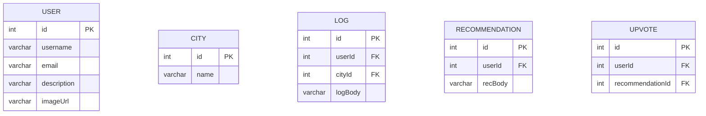

```mermaid
erDiagram

USER {
    int id PK
    varchar username
    varchar email
    varchar description
    varchar imageUrl
}

CITY {
    int id PK
    varchar name
}

LOG {
    int id PK
    int userId FK
    int cityId FK
    varchar logBody
}

RECOMMENDATION {
    int id PK
    int userId FK
    varchar recBody
}

UPVOTE {
    int id PK
    int userId FK
    int recommendationId FK
}
```
